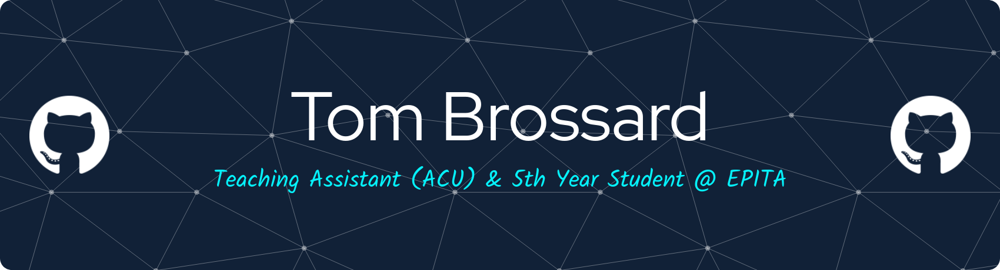

<!-- Header generated thanks to this site: https://leviarista.github.io/github-profile-header-generator/ -->
 

# 👦 About me

Hi! I'm a French student in my 5th year at **[EPITA](https://www.epita.fr/)**.

Here, You'll find some personal projects I've built while learning. Feel free to
explore!

  

# ✨ Projects

Here are some of my personal projects:

- **[Marbl-lang](https://github.com/tombrossard0/marbl-lang) & [Marbl-code](https://github.com/tombrossard0/marbl-code)**
  A custom programming language and its compiler, designed to explore language design and compiler construction. The main inspiration of this project comes from [Crafting interpreter](https://craftinginterpreters.com/introduction.html) from Robert Nystrom. I have adapted the whole with my ideas and as a compiler. **Marbl-code** is the VSCode extension associated to auto-completion and highligting syntax.
- **[Mini-Git](https://github.com/tombrossard0/mini-git)**  
  A *very* simplified version of Git implemented from scratch, featuring object storage, commit history, and basic clonning https (and unpack compressed data).
- **[Raytracing with CUDA](https://github.com/tombrossard0/raytracing-with-cuda)**  
  GPU-accelerated raytracing in C++, supporting real-time rendering of 3D scenes and animated GIF generation.
  
- **[Nonogram Solver](https://github.com/tombrossard0/Nonogramme-Solver)**  
  An algorithmic solver for Nonogram puzzles using constraint satisfaction and backtracking algorithms.
